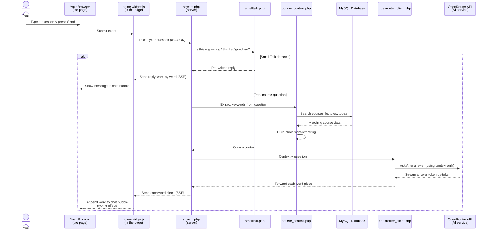

# NextGen Chatbot — How It Works

This document explains the chatbot step by step, starting from **how it appears on a webpage** all the way to **how it gets you an answer**. No coding knowledge needed.

---

## 1. How the Chatbot Gets Onto a Page

The website has three **page layouts** (templates that wrap every page):

| Layout file | Where it's used |
|---|---|
| `layouts/website.php` | Public pages (Home, Courses, About, Sign In, etc.) |
| `layouts/student.php` | Student dashboard (My Courses, etc.) |
| `layouts/admin.php` | Admin / Instructor dashboard |

Each of these three layouts has **one line** near the bottom that pulls in the chatbot:

```
include 'chatbot/widget.php'
```

Think of it like a stamp: every page that uses one of these layouts automatically gets the chatbot widget added to it. You don't have to add it page by page.

---

## 2. What the Widget Looks Like

When `widget.php` runs, it outputs three things onto the page:

1. **A CSS stylesheet** — gives the chatbot its look (blue button, chat window, message bubbles, position on screen)
2. **HTML elements** — the floating blue button, the chat window (header, message area, input box), the close button
3. **A JavaScript file** (`home-widget.js`) — makes everything interactive

The result is a small blue chat icon in the bottom-right corner of every page.

---

## 3. What Happens When You Type a Message

Here is the full journey of your question, step by step:



---

## 4. The Two Paths Your Question Can Take

### Path A — Small Talk (greetings, thanks, goodbye)

If you type something like "Hi", "Thanks", "Bye", or "How are you?", the system detects it immediately via `smalltalk.php` and sends back a **canned (pre-written) reply** instantly. No database lookup, no AI call. This saves money and makes it fast.

Examples:
- "Hi" → "Hello! Ask me anything about our courses..."
- "Thanks" → "You're welcome!"
- "Who are you?" → "I'm the NextGen Learning course assistant."

### Path B — A real course question

If you ask something like "What is in the Python course?" or "Which courses are free?", the system:

1. **Extracts keywords** from your question (e.g., "Python", "free", "HTML")
2. **Queries the database** to find courses, lectures, and topics matching those keywords
3. **Builds a "context" string** — a short summary of the matching course data
4. **Sends that context + your question** to an AI model (via OpenRouter)
5. The **AI reads only that context** and answers your question based on it
6. The answer is **streamed back** word by word (like someone typing in real time)

If no matching courses are found in the database, the chatbot says: *"I don't have any course information for that yet."* — it never makes something up.

---

## 5. The Two JavaScript Versions

There are two JavaScript files that power the chat. They work almost the same way, but talk to different server endpoints:

| JavaScript file | Used on | Talks to | How the answer arrives |
|---|---|---|---|
| `home-widget.js` | All regular pages (public, student dashboard, admin) | `stream.php` | **Word by word** (streaming) — you see the answer being typed out |
| `course-widget.js` | The course watch page (`student/watch_course.php`) | `api.php` | **All at once** (non-streaming) — the full answer appears after a moment |

Both do the same job: take your question, send it to the server, and show the answer.

---

## 6. The AI Model and API Key

The chatbot uses **OpenRouter**, a service that gives access to many AI models (like Google's Gemma, OpenAI's GPT, etc.). The system tries models in order and falls back to the next one if the first fails.

To make it work, someone must:
1. Create a free account at [openrouter.ai](https://openrouter.ai)
2. Get an API key
3. Set it as an environment variable named `OPENROUTER_API_KEY` on the server

The API key never leaves the server — it is never sent to your browser or visible in the page source.

---

## 7. Folder Structure (Chatbot Files)

```
chatbot/
├── config.php              — Reads API key and settings
├── widget.php              — The HTML/CSS/JS that gets added to every page
├── stream.php              — Server endpoint (streaming, word-by-word answers)
├── api.php                 — Server endpoint (non-streaming, full answer at once)
├── smalltalk.php           — Detects greetings/thanks/goodbye
├── course_context.php      — Extracts keywords and queries the database
├── openrouter_client.php   — Talks to the OpenRouter AI service
├── index.php               — Standalone full-page chatbot
├── quiz.php                — Generates quiz questions from course content
├── .env                    — Local environment variables (for development only)
├── .htaccess               — Security: blocks direct access to .env
└── assets/
    ├── home-widget.css     — Styles for the floating chat widget
    ├── home-widget.js      — Interactive behavior for the floating widget
    ├── course-widget.js    — Interactive behavior for the course-page widget
    ├── chatbot.css         — Styles for the standalone chatbot page
    └── chatbot.js          — Interactive behavior for the standalone chatbot page
```

---

## 8. Which Files Touch Which Layouts

| Layout file | Includes widget.php at line |
|---|---|
| `layouts/website.php` | Line 241 |
| `layouts/admin.php` | Line 275 |
| `layouts/student.php` | Line 224 |

Each layout sets `$ngChatBasePath` correctly before including the widget so that all CSS and JS paths work regardless of whether the page is in the root folder or a subfolder like `admin/` or `student/`.

---

## 9. Quick Summary

1. **Layouts** include `widget.php` → chatbot appears on every page
2. **You type a question** → `home-widget.js` catches it
3. **JavaScript sends** your question to `stream.php` on the server
4. **Server checks** if it's small talk (canned reply) or a real question
5. **For real questions**, the server looks up courses in the database
6. **Course data + question** sent to an AI model via OpenRouter
7. **AI answers** based only on the course data provided
8. **Answer streams back** word by word into the chat window
